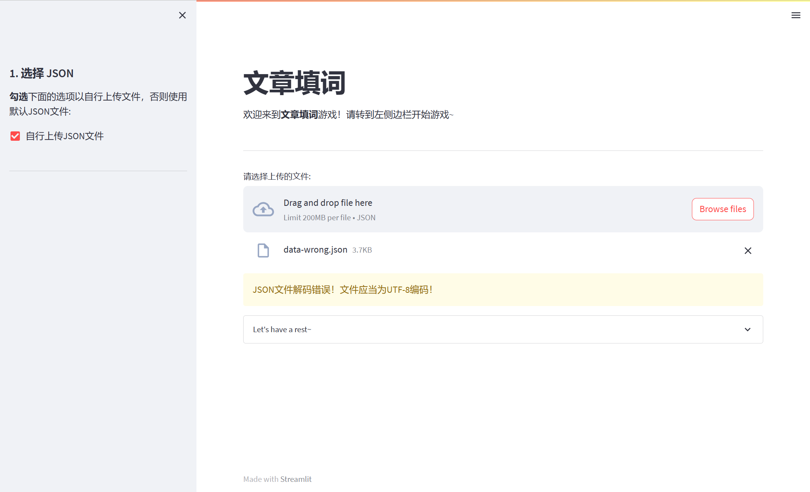
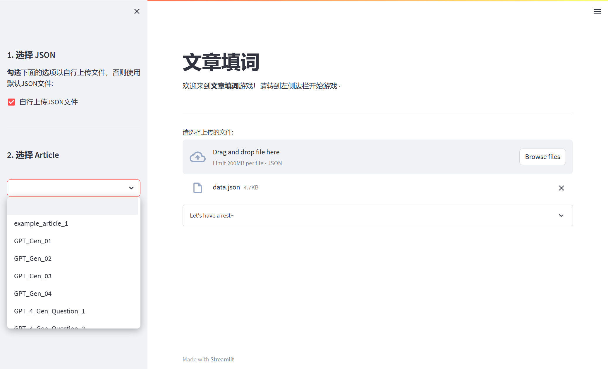
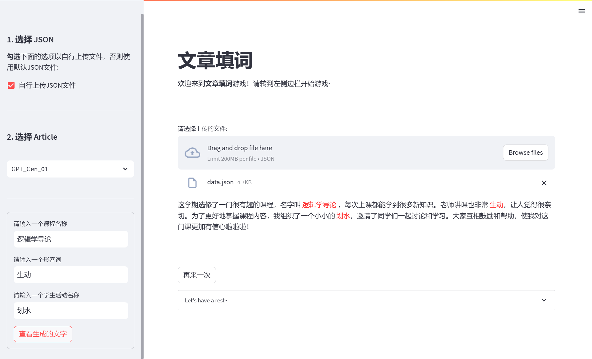

# CrossWordPuzzle
一个简单的文章填词游戏，用Python编程实现。

**目录**
- [1. 基础版](#1-基础版)
	* [1.1 项目环境](#11-项目环境)
	* [1.2 使用配置](#12-使用配置)
	* [1.3 游戏说明](#13-游戏说明)
	  + [使用示例1](#使用示例1)
	  + [使用示例2](#使用示例2)
- [2. GUI版](#2-gui版)
	* [2.1 项目环境](#21-项目环境)
	* [2.2 使用配置](#22-使用配置)
	* [2.3 游戏说明](#23-游戏说明)
- [NOTE](#note)

本游戏分**基础版**和**GUI版**两个版本：

## 1. 基础版

### 1.1 项目环境

[基础版](./Basic_Version)使用命令行参数启动。此版本未使用任何第三方库，Python版本为3.8.17，可以使用如下命令创建相应的Python环境：

```bash
conda create -n <env_name> python=3.8
```

### 1.2 使用配置

在虚拟环境`<env_name>`中，可以使用如下的命令运行此程序：

```bash
python main_basic_version.py [-h] [--path PATH] [--article ARTICLE]
```

参数说明:
```
  -h, --help         #显示帮助信息
  --path PATH        #设定题库数据JSON文件的路径，默认为当前路径下的data.json文件
  --article ARTICLE  #设定选择的文章标题，默认为random，即从题库中任选一篇文章
```

### 1.3 游戏说明

程序[基础版](./Basic_Version)实现了基础功能，包括：

- 根据命令行参数启动，命令行参数包括：指定题库数据文件路径、指定文章标题、显示帮助信息等；命令行参数的相关操作主要用到了`argparse`库；
- 读取相应的题库并解析JSON文件；解析JSON文件主要用到`json`库；
- 在命令行中接收用户输入并将其填写到文章中；文章填空处用特殊标志`<\d>`；使用`re`模块的`sub`函数进行替换；
- 用户完成输入后，将替换后的文章打印到命令行；

程序[基础版](./Basic_Version)也实现了部分高级功能，包括：

- 鲁棒性。使用`try...except...`进行错误检查，当出现如下错误时，程序给出相应的提示：
  - 题库JSON文件路径不正确；
  - JSON文件不能解析为字典列表；
  - JSON文件中的某个字典的某个`key`名称不正确；每个字典有且仅有3个`key`: `title`, `article`, `hints`；
  - JSON文件中的某个字典的某个value的类型不正确；`title`, `article`, `hints`对应的值的类型须为`str`, `str`, `list`；
  - 题库JSON文件中不存在给定的文章。

#### 使用示例1

使用默认题库数据、随机选择一篇文章进行游戏：

```bash
python main_basic_version.py
```

#### 使用示例2

使用自定义数据库`path/to/file.json`，选择文章`sample1`进行游戏：

```bash
python main_basic_version.py --path path/to/file.json --article sample1
```


## 2. GUI版

### 2.1 项目环境

此[GUI版](./GUI_GUI_Version)使用`streamlit`库搭建GUI框架。`streamlit`版本为1.24.1。你可以使用如下命令安装：

```bash
pip install streamlit
```

为提高`pip`的安装速度，可参考tuna的[pypi镜像站使用帮助](https://mirrors.tuna.tsinghua.edu.cn/help/pypi/)进行配置。

**TODO**  在操作过程中遇到一个小问题：如果直接用`conda`安装，似乎在运行`streamlit`程序时，会抛出错误信息“`streamlit.cli`未找到”；但用`pip`安装则未出现此问题。有兴趣的读者可以探索。

 除`streamlit`库及其依赖，此程序未用到其他的第三方库。

### 2.2 使用配置

使用如下命令运行此程序：

```bash
streamlit run main_GUI_version.py
```

执行上述命令后，你会得到一个URL；在浏览器打开即可开始游戏！

### 2.3 游戏说明

程序[GUI版](./GUI_Version)实现了基础功能，包括：

- 选择题库JSON文件与文章标题；用户可以选择使用默认的`data/data.json`文件，或者自行上传符合规范的`utf-8`编码的JSON文件。JSON文件的规范为：

  - 可解析为字典列表；
  - 每个字典有且仅有3个`key`: `title`, `article`, `hints`；
  - `title`, `article`, `hints`对应的值的类型须为`str`, `str`, `list`；

  通过`checkbox`选择使用默认题库还是自行上传题库，通过`file_uploader`上传JSON文件（用户只能上传JSON类型的文件），解析JSON文件后得到文章标题组成的列表，然后通过`selectbox`选择文章标题。

- 根据读取的题库解析JSON文件；解析JSON文件主要用到`json`库；

- 通过`form`（表单）配合一定数量的`text_input`（输入框）接收用户输入，并将其填写到文章中；文章填空处用特殊标志`<\d>`；使用`re`模块的`sub`函数进行替换；

- 用户完成输入后，将替换后的文章显示到页面；

此版本也实现了如下拓展功能：

- GUI界面。使用`streamlit`库完成了从命令行到GUI的转变。

  页面打开时，如下图所示：


  根据提示，安装左侧边栏的步骤进行操作。如果自行上传文件，需上传符合规范的JSON文件，否则页面上会给出错误信息。例如，上传了非`utf-8`编码（你可以试试用Notepad++等工具将一个文件的编码改为`ANSI`）的JSON文件，会给出如下图所示的错误提示：



  如果不勾选“自行上传”，则可以直接从第2步“选择Article”开始进行游戏，此时使用默认题库；若勾选“自行上传”，则上传JSON文件并解析无误后，系统根据解析得到的字典列表的`title`值组成文章列表，以供用户选择：



  用户选择文章并根据提示完成输入后，点击左侧边栏的“查看”按钮，可以在页面上生成完成填空的文字，用户填空用红色标记，如下图所示：




- 鲁棒性。除了基础版本的错误，还可以检测：
  - JSON文件非`utf-8`编码错误；通过`UnicodeDecodeError`；
  - JSON文件格式不符合规范导致不能解析的错误；通过`json.JSONDecodeError`；


## NOTE

All the text files are encoded with `utf-8`, End-of-Line-Sequence is `LF`.  
You can visit [it](https://crosswordpuzzle-summer2023-sunxl18.streamlit.app/) if you have access to science network.

**Author**: sunxl18@foxmail.com  
**Date**: 2023/7/20  
**Version**: v1.0